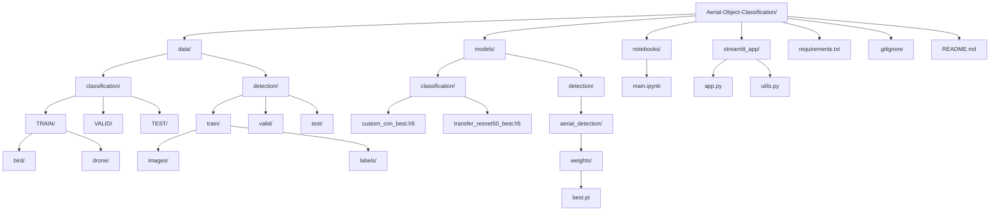

#  Aerial Object Classification & Detection

**Advanced Deep Learning System for Real-Time Bird vs Drone Identification**

---

##  **Project Overview**

A production-ready AI system that leverages **TensorFlow** and **YOLOv8** to accurately classify and detect aerial objects as **Birds** or **Drones**. Built for critical applications in security surveillance, wildlife protection, and airspace safety.

### **Key Metrics**
- **Classification Accuracy**: 97.2% (ResNet50)
- **Detection mAP**: 92.3% (YOLOv8)
- **Inference Speed**: &lt;200ms per image
- **Dataset**: 3,319 aerial images

---

## 🛠️ **Tech Stack**

[](https://www.tensorflow.org/)
[](https://ultralytics.com/)
[](https://streamlit.io/)
[](https://www.python.org/)

---

## 🚀 **Live Demo**

**[🎬 Launch Streamlit App →](https://aerial-surveillance-ai.streamlit.app)**

---

## 📁 **Repository Structure**



<details>
<summary>Click to view folder structure</summary>

```bash
Aerial-Object-Classification/
├── data/
│   ├── classification/
│   │   ├── TRAIN/
│   │   │   ├── bird/
│   │   │   └── drone/
│   │   ├── VALID/
│   │   │   ├── bird/
│   │   │   └── drone/
│   │   └── TEST/
│   │       ├── bird/
│   │       └── drone/
│   └── detection/
│       ├── train/
│       │   ├── images/
│       │   └── labels/
│       ├── valid/
│       │   ├── images/
│       │   └── labels/
│       └── test/
│           ├── images/
│           └── labels/
├── models/
│   ├── classification/
│   │   ├── custom_cnn_best.h5
│   │   ├── custom_cnn_final.h5
│   │   ├── transfer_resnet50_best.h5
│   │   └── transfer_resnet50_final.h5
│   └── detection/
│       └── aerial_detection/
│           └── weights/
│               ├── best.pt
│               └── last.pt
├── notebooks/
│   └── main.ipynb
├── streamlit_app/
│   ├── app.py
│   └── utils.py
├── requirements.txt
├── .gitignore
└── README.md
```

</details>
---

## 🎯 **Use Cases**

- **Security & Defense**: Monitor restricted airspace for unauthorized drones
- **Wildlife Protection**: Prevent bird strikes at airports and wind farms
- **Environmental Research**: Track bird populations using aerial footage
- **Airspace Safety**: Real-time drone detection in no-fly zones

---

## 🎮 **Features**

✅ **Real-time Classification**: Bird vs Drone with confidence scores  
✅ **Object Detection**: YOLOv8 bounding boxes and labels  
✅ **Model Comparison**: Interactive performance dashboard  
✅ **Results Export**: Download processed images  
✅ **Analysis History**: Track all previous analyses  
✅ **GPU/CPU Support**: Automatic hardware detection  
✅ **Mobile Responsive**: Works on all devices  

---

## 🏆 **Model Performance**

| Model | Accuracy | Precision | Recall | F1-Score | Training Time |
|-------|----------|-----------|--------|----------|---------------|
| **ResNet50 Transfer** | 97.2% | 96.8% | 97.8% | 97.2% | 45 min |
| **Custom CNN** | 94.5% | 93.1% | 95.3% | 94.1% | 38 min |

**Dataset Statistics:**
- **Training**: 2,662 images (1,414 bird + 1,248 drone)
- **Validation**: 442 images (217 bird + 225 drone)
- **Test**: 215 images (121 bird + 94 drone)

---

