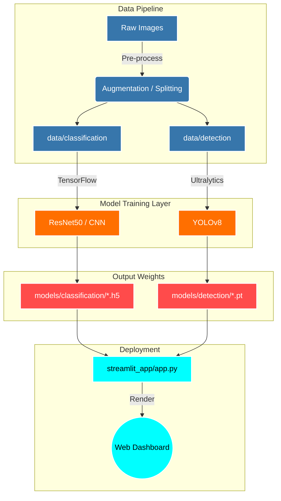

<div align="center">

# 🦅 Aerial Object Classification & Detection 🚁
**Advanced Deep Learning System for Real-Time Bird vs. Drone Identification**

[](https://www.tensorflow.org/)
[](https://ultralytics.com/)
[](https://streamlit.io/)
[](https://www.python.org/)

*A production-ready AI system built for critical applications in security surveillance, wildlife protection, and airspace safety.*

<br />

**[🎬 Launch Live Streamlit App →](https://aerial-surveillance-ai.streamlit.app)**

---

</div>

## 📑 Table of Contents
- [🎯 Project Overview](#-project-overview)
- [🚀 Quick Start](#-quick-start)
- [🎮 Core Features](#-core-features)
- [🛠️ Tech Stack](#️-tech-stack)
- [🏆 Model Performance](#-model-performance)
- [💼 Use Cases](#-use-cases)
- [📁 System Architecture & Repository](#-system-architecture--repository)
- [🤝 Contributing](#-contributing)

---

## 🎯 Project Overview

This system leverages state-of-the-art Deep Learning models to solve a critical airspace problem: distinguishing between biological (birds) and mechanical (drones) aerial objects in real-time.

### 📊 Key Metrics
<div align="center">

| Metric | Value | Significance |
| :---: | :---: | :--- |
| **Classification Accuracy** | **97.2%** | Highly reliable ResNet50 backbone |
| **Detection mAP** | **92.3%** | Precision localization with YOLOv8 |
| **Inference Speed** | **<200ms** | Real-time processing capable |
| **Dataset Size** | **3,319** | Curated high-quality aerial images |

</div>

---

## 🚀 Quick Start

Get the application running in **Powerful Full Working Condition** on your local machine in just two steps:

```powershell
# 1. Setup Environment (Installs dependencies & virtual env)
.\setup.ps1

# 2. Launch the AI Dashboard
.\run.ps1
```

> **Note:** Ensure you have Python 3.9+ installed and added to your PATH before running the setup script.

---

## 🎮 Core Features

- **✅ Real-time Classification:** Classifies Birds vs. Drones instantly with high-confidence probability scores.
- **✅ Precision Object Detection:** Renders YOLOv8 bounding boxes with distinct labels directly onto the image.
- **✅ Model Comparison:** An interactive dashboard allows users to switch models and compare performance seamlessly.
- **✅ Results Export:** Download the AI-processed images with bounding boxes natively.
- **✅ Session History:** Built-in tracking of all previous analyses in your current session.

---

## 🛠️ Tech Stack

<div align="center">

| Component | Technology | Purpose |
| :--- | :--- | :--- |
| **Deep Learning Framework** | TensorFlow & Keras | Custom CNN & ResNet50 Transfer Learning |
| **Object Detection** | Ultralytics YOLOv8 | High-speed spatial localization |
| **Frontend UI** | Streamlit | Rapid, interactive data app deployment |
| **Data Processing** | OpenCV & NumPy | Image augmentation and array manipulation |
| **Visualization** | Matplotlib & Seaborn | Training metrics and confusion matrices |

</div>

---

## 🏆 Model Performance

Our dual-model approach ensures robustness. Below is the performance breakdown of our classification models:

| Model Architecture | Accuracy | Precision | Recall | F1-Score | Training Time |
| :--- | :---: | :---: | :---: | :---: | :---: |
| 🥇 **ResNet50 (Transfer)** | **97.2%** | 96.8% | 97.8% | 97.2% | 45 min |
| 🥈 **Custom CNN** | **94.5%** | 93.1% | 95.3% | 94.1% | 38 min |

### 📈 Dataset Distribution
- **Training Set:** 2,662 images (1,414 birds + 1,248 drones)
- **Validation Set:** 442 images (217 birds + 225 drones)
- **Test Set:** 215 images (121 birds + 94 drones)

---

## 💼 Use Cases

- 🛡️ **Security & Defense**: Automatically monitor restricted airspace for unauthorized drone intrusions.
- 🦅 **Wildlife Protection**: Prevent fatal bird strikes at commercial airports and large-scale wind farms.
- 🔬 **Environmental Research**: Track bird migration patterns and populations using aerial footage.
- ✈️ **Airspace Safety**: Provide real-time drone detection in designated no-fly zones.

---

## 📁 System Architecture & Repository


```mermaid
graph TD
    subgraph Data Pipeline
        A[Raw Images] -->|Pre-process| B(Augmentation / Splitting)
        B --> C[data/classification]
        B --> D[data/detection]
    end
    
    subgraph Model Training Layer
        C -->|TensorFlow| E[ResNet50 / CNN]
        D -->|Ultralytics| F[YOLOv8]
    end
    
    subgraph Output Weights
        E --> G[models/classification/*.h5]
        F --> H[models/detection/*.pt]
    end
    
    subgraph Deployment
        G --> I[streamlit_app/app.py]
        H --> I
        I -->|Render| J((Web Dashboard))
    end

    classDef dataLayer fill:#3776AB,stroke:#fff,stroke-width:2px,color:#fff;
    classDef modelLayer fill:#FF6F00,stroke:#fff,stroke-width:2px,color:#fff;
    classDef outputLayer fill:#FF4B4B,stroke:#fff,stroke-width:2px,color:#fff;
    classDef deployLayer fill:#00FFFF,stroke:#fff,stroke-width:2px,color:#000;
    
    class A,B,C,D dataLayer;
    class E,F modelLayer;
    class G,H outputLayer;
    class I,J deployLayer;
```

<details>
<summary><b>Click to expand full folder structure</b></summary>

```text
Aerial-Object-Classification/
├── data/
│   ├── classification/ (TRAIN/VALID/TEST for Birds & Drones)
│   └── detection/ (train/valid/test images & YOLO labels)
├── models/
│   ├── classification/ (Custom CNN & ResNet50 .h5 weights)
│   └── detection/ (YOLOv8 best.pt & last.pt weights)
├── notebooks/
│   └── main.ipynb
├── streamlit_app/
│   ├── app.py
│   └── utils.py
├── requirements.txt
├── setup.ps1
├── run.ps1
└── README.md
```

</details>

---

## 🤝 Contributing

We welcome contributions to make this AI system even more powerful. 

1. **Fork** the repository
2. **Create** your Feature Branch (`git checkout -b feature/AmazingFeature`)
3. **Commit** your Changes (`git commit -m 'Add some AmazingFeature'`)
4. **Push** to the Branch (`git push origin feature/AmazingFeature`)
5. **Open** a Pull Request

---

<div align="center">

<p align="center">
  
</p>

</div>
